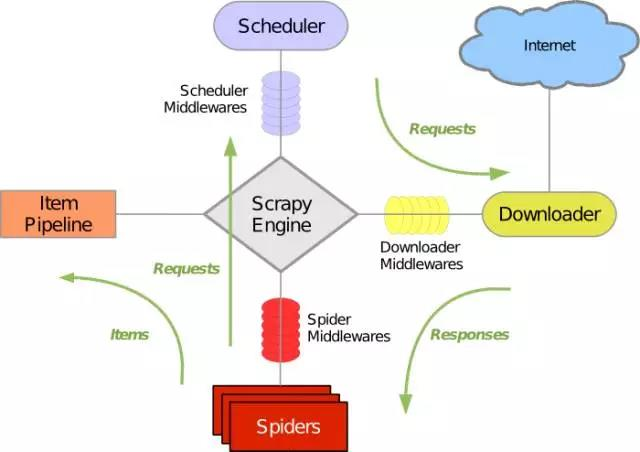

# 爬虫Scrapy框架详解

## 1. 概述
下图显示了 Scrapy 的大体架构，其中包含了它的主要组件及系统的数据处理流程（绿色箭头所示）。下面就来一个个解释每个组件的作用及数据的处理过程。



## 2. 组件

### 2.1 Scrapy Engine （Scrapy 引擎）

Scrapy 引擎是用来控制整个系统的数据处理流程，并进行事务处理的触发。更多的详细内容可以看下面的数据处理流程。

### 2.2 Scheduler （调度）

调度程序从 Scrapy 引擎接受请求并排序列入队列，并在 Scrapy 引擎发出请求后返还给他们。

### 2.3 Downloader （下载器）

下载器的主要职责是抓取网页并将网页内容返还给蜘蛛  ( Spiders )。

### 2.4 Spiders （蜘蛛）

蜘蛛是有 Scrapy 用户自己定义用来解析网页并抓取制定 URL 返回的内容的类，每个蜘蛛都能处理一个域名或一组域名。换句话说就是用来定义特定网站的抓取和解析规则。

蜘蛛的整个抓取流程（周期）是这样的：

首先获取第一个 URL 的初始请求，当请求返回后调取一个回调函数。第一个请求是通过调用 ```start_requests()```方法。该方法默认从``` start_urls ```中的 ``` Url ```中生成请求，并执行解析来调用回调函数。
在回调函数中，你可以解析网页响应并返回项目对象和请求对象或两者的迭代。这些请求也将包含一个回调，然后被``` Scrapy ```下载，然后有指定的回调处理。
在回调函数中，你解析网站的内容，同程使用的是``` Xpath ```选择器（但是你也可以使用``` BeautifuSoup ```,``` lxml ```或其他任何你喜欢的程序），并生成解析的数据项。
最后，从蜘蛛返回的项目通常会进驻到项目管道。

### 2.5 Item Pipeline （项目管道）

项目管道的主要责任是负责处理有蜘蛛从网页中抽取的项目，他的主要任务是清晰、验证和存储数据。当页面被蜘蛛解析后，将被发送到项目管道，并经过几个特定的次序处理数据。每个项目管道的组件都是有一个简单的方法组成的 Python 类。他们获取了项目并执行他们的方法，同时他们还需要确定的是是否需要在项目管道中继续执行下一步或是直接丢弃掉不处理。

项目管道通常执行的过程有：

- 清洗 HTML 数据

- 验证解析到的数据（检查项目是否包含必要的字段）

- 检查是否是重复数据（如果重复就删除）

- 将解析到的数据存储到数据库中

### 2.6 Downloader middlewares （下载器中间件）

下载中间件是位于 Scrapy 引擎和下载器之间的钩子框架，主要是处理 Scrapy 引擎与下载器之间的请求及响应。它提供了一个自定义的代码的方式来拓展 Scrapy 的功能。下载中间器是一个处理请求和响应的钩子框架。他是轻量级的，对 Scrapy 尽享全局控制的底层的系统。

### 2.7 Spider middlewares （蜘蛛中间件）

蜘蛛中间件是介于 Scrapy 引擎和蜘蛛之间的钩子框架，主要工作是处理蜘蛛的响应输入和请求输出。它提供一个自定义代码的方式来拓展 Scrapy 的功能。蛛中间件是一个挂接到 Scrapy 的蜘蛛处理机制的框架，你可以插入自定义的代码来处理发送给蜘蛛的请求和返回蜘蛛获取的响应内容和项目。

### 2.8 Scheduler middlewares （调度中间件）

调度中间件是介于 Scrapy 引擎和调度之间的中间件，主要工作是处从 Scrapy 引擎发送到调度的请求和响应。他提供了一个自定义的代码来拓展 Scrapy 的功能。

## 3. 数据处理的流程

Scrapy 的整个数据处理流程有 Scrapy 引擎进行控制，其主要的运行方式为：

- 引擎打开一个域名，时蜘蛛处理这个域名，并让蜘蛛获取第一个爬取的 URL 。
- 引擎从蜘蛛那获取第一个需要爬取的 URL ，然后作为请求在调度中进行调度。
- 引擎从调度那获取接下来进行爬取的页面。
- 调度将下一个爬取的 URL 返回给引擎，引擎将他们通过下载中间件发送到下载器。
- 当网页被下载器下载完成以后，响应内容通过下载中间件被发送到引擎。
- 引擎收到下载器的响应并将它通过蜘蛛中间件发送到蜘蛛进行处理。
- 蜘蛛处理响应并返回爬取到的项目，然后给引擎发送新的请求。
- 引擎将抓取到的项目项目管道，并向调度发送请求。
- 系统重复第二部后面的操作，直到调度中没有请求，然后断开引擎与域之间的联系。

## 4. 驱动器

Scrapy是由Twisted写的一个受欢迎的Python事件驱动网络框架，它使用的是非堵塞的异步处理。
